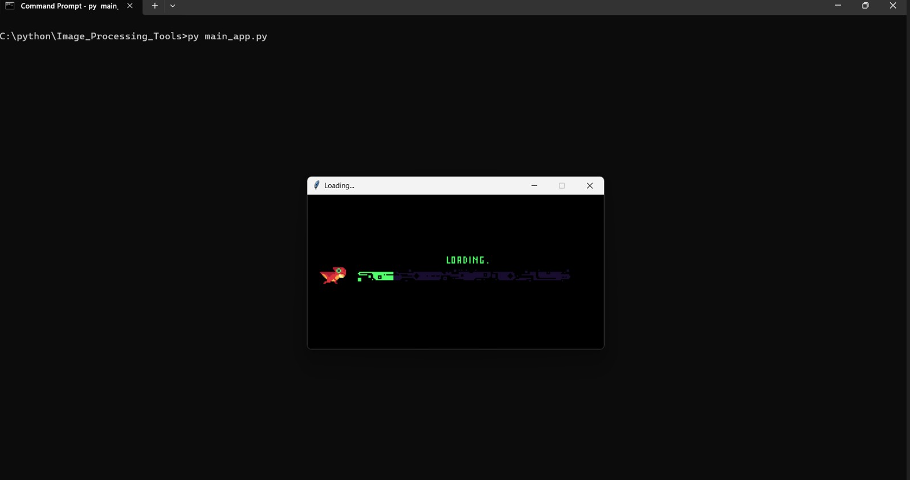
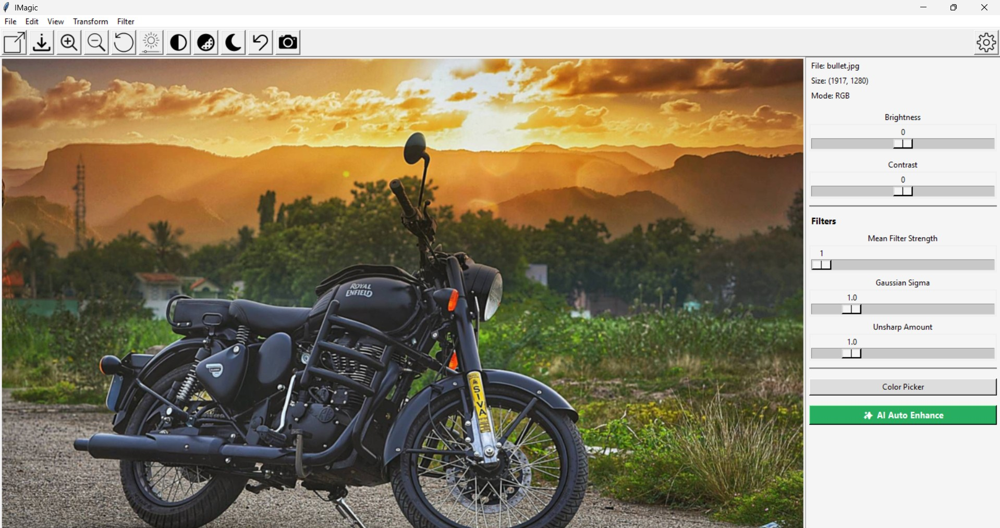

# Image Processing Tools
A powerful Python Tkinter-based Image Editor with modern UI, real-time camera integration, and advanced filters.

## Features
✨ Features
🟢 Open & Save Images – JPG, PNG, JPEG support

🟢 Zoom & Rotate – 90°, 180°, Flip

🟢 Brightness & Contrast adjustment sliders

🟢 Grayscale & Custom Filters

🟢 Undo & Reset

🟢 Dark Mode

🟢 Real-Time Camera Feed

🟢 Loading Splash Screen

🟢 Professional Toolbar Icons

🟢 Resizable UI

🛠️ Tech Stack
Python 3

Tkinter

Pillow (PIL)

OpenCV

How to Run
1️⃣ Install Dependencies

bash
Copy
Edit
pip install pillow opencv-python
2️⃣ Run Application

bash
Copy
Edit
python main_app.py
🖥️ Screenshots

